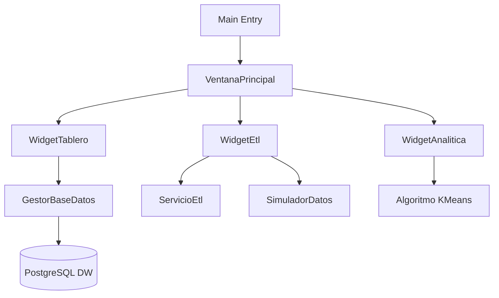

# 📊 Sistema OLAP & Data Mining 2025


> **Una plataforma integral de escritorio para Extracción, Transformación, Carga (ETL) y Análisis de Datos (OLAP) desarrollada en C++ con Qt 6.**

---

## 🚀 Descripción del Proyecto

Este sistema está diseñado para demostrar potentes capacidades de **Business Intelligence (BI)** integradas en una aplicación nativa de alto rendimiento. Combina la robustez de PostgreSQL para el almacenamiento de Data Warehouse con la velocidad de C++ para el procesamiento y visualización de datos.

El objetivo principal es permitir a las organizaciones visualizar tendencias de ventas, gestionar procesos masivos de datos y realizar proyecciones analíticas avanzadas.

## ✨ Características Principales

### 1. 📈 Tablero de Control (Dashboard)
- Visualización interactiva de **Tendencias de Ventas Mensuales** mediante gráficos de líneas.
- Tabla Pivot dinámica para el **Desempeño por Categoría**, Región y transacciones.
- Indicadores clave de rendimiento (KPIs) en tiempo real.

### 2. 🔄 Motor ETL (Extract, Transform, Load)
- **Simulador de Datos Integrado**: Genera millones de registros de prueba (Ventas, Productos, Sucursales) para pruebas de estrés.
- **Carga Masiva (Bulk Loading)**: Utiliza el protocolo `COPY` de PostgreSQL para insertar 50,000+ registros en segundos.
- **Transformación**: Creación automática de Vistas Materializadas para optimizar consultas OLAP complejas (Esquema Estrella).

### 3. 🧠 Analítica Avanzada (Minería de Datos)
- Implementación del algoritmo **K-Means Clustering** desde cero en C++.
- Segmentación de clientes basada en comportamiento de compra (Recencia, Frecuencia, Valor Monetario).
- Visualización de clusters mediante gráficos de dispersión (Scatter Plots).

---

## 🛠️ Tecnologías Utilizadas

- **Lenguaje Core**: C++17 (Modern C++)
- **Framework UI**: Qt 6.10 (Widgets & Charts)
- **Base de Datos**: PostgreSQL 14+ (Driver QPSQL / libpq)
- **Build System**: CMake & Ninja
- **Herramientas**: Visual Studio Code, Git

---

## ⚙️ Requisitos de Instalación

1. **PostgreSQL**: Tener instalado PostgreSQL 14 o superior.
2. **Qt 6 SDK**: Kit de desarrollo Qt con soporte para MinGW 64-bit y módulo `QtSql`.
3. **CMake**: Versión 3.16+.

### Configuración de Base de Datos
Crear una base de datos llamada `bd2025` y un usuario con permisos.

```sql
CREATE DATABASE bd2025;
CREATE USER postgres WITH PASSWORD 'laza'; -- O ajustar en src/core/GestorBaseDatos.cpp
GRANT ALL PRIVILEGES ON DATABASE bd2025 TO postgres;
```

## 🖥️ Cómo Ejecutar

```bash
# 1. Clonar el repositorio
git clone https://github.com/lazamartinez/OLAP2025.git

# 2. Configurar el proyecto
cmake -S . -B build -G "Ninja"

# 3. Compilar
cmake --build build

# 4. Ejecutar (Usando script auxiliar para variables de entorno)
./run_app.ps1
```

---

## 🖼️ Estructura del Proyecto



---

## 📄 Licencia

Este proyecto es de código abierto bajo la licencia [MIT](LICENSE).

---
*Desarrollado con ❤️ por Facu Martínez*
