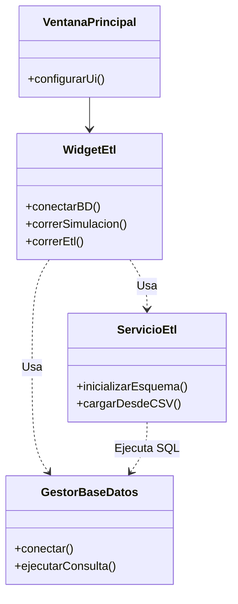

# Documentación del Proyecto y Herramientas Gráficas

Este proyecto incluye diagramas en formato **Mermaid.js**, que es la opción recomendada para documentación técnica en texto.

## ¿Dónde visualizar los diagramas?
1. **GitHub/GitLab**: Renderizan Mermaid nativamente en los `.md`.
2. **VS Code**: Instalar extensión "Markdown Preview Mermaid Support".
3. **Live Editor**: [Mermaid Live Editor](https://mermaid.live).

## Otras Herramientas Recomendadas (Según Solicitud)
- **Diagramas Drag-and-Drop**: [Drawflow](https://github.com/jerosoler/Drawflow) (Open Source, web based).
- **Profesional / Empresarial**: [GoJS](https://gojs.net) (Licencia comercial requerida, muy potente).
- **Reemplazo draw.io en App**: [mxGraph](https://github.com/jgraph/mxgraph) (Base de draw.io) o [Diagram.js](https://bpmn.io/toolkit/bpmn-js/).
- **Conectores Visuales**: [jsPlumb](https://github.com/jsplumb/jsplumb) (Ideal para conectar nodos en aplicaciones web).

## Diagrama de Arquitectura Actual (Mermaid)

